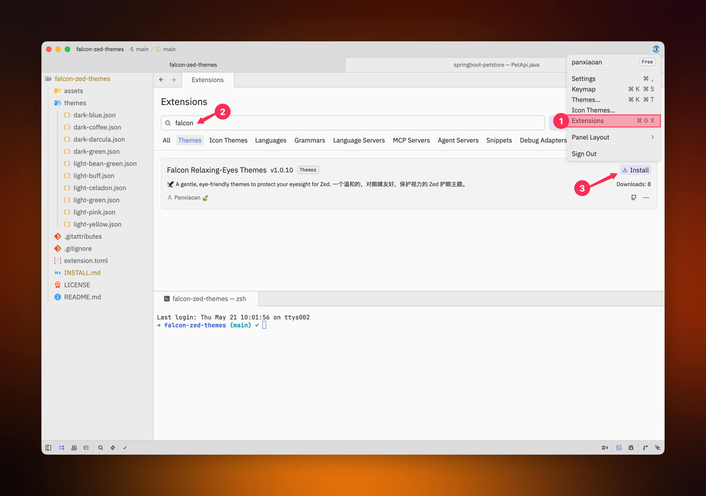
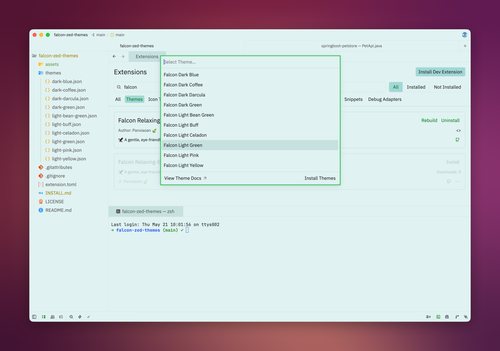

### [Zed](https://zed.dev)

#### Install in Zed Extensions

1. Open Zed.
2. Press <kbd>Cmd</kbd>+<kbd>Shift</kbd>+<kbd>X</kbd> to open the Extensions view, or type `zed: extensions` in the command palette.
3. Search for `falcon` and click **Install**.
4. Open the Command Palette (<kbd>Cmd</kbd>+<kbd>Shift</kbd>+<kbd>P</kbd>), type `theme selector: toggle`, and select your preferred Falcon theme (e.g., `Falcon Light Green`, `Celadon`, `Grey`, etc.).

 &nbsp;&nbsp; 

#### Install manually

1. Clone the repo using Git:
```bash
git clone https://github.com/panxiaoan/falcon-zed-themes.git
```
2. Open Zed, go to the Extensions page, click the "Install Dev Extension" button(or the zed: install dev extension action), and select the cloned project directory falcon-zed-themes. and select the directory containing your extension.
3. Select the theme (`Settings` ➡️ `Select Theme` ➡️ `Falcon Light Green`).
4. ✨ Boom! It's working！！！
