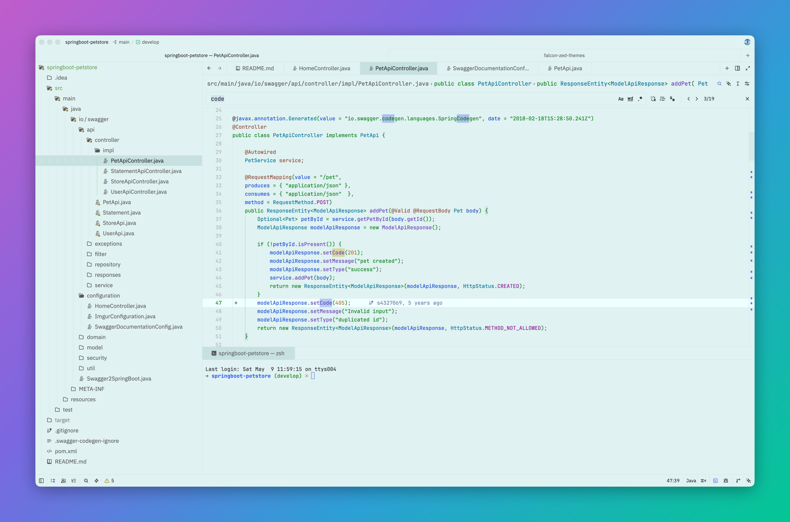
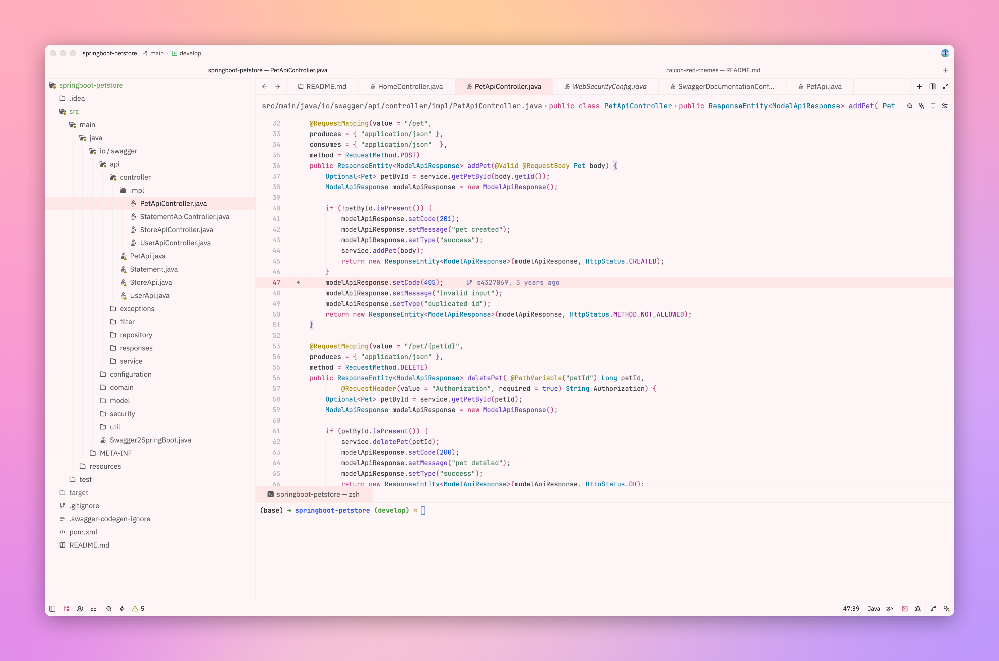
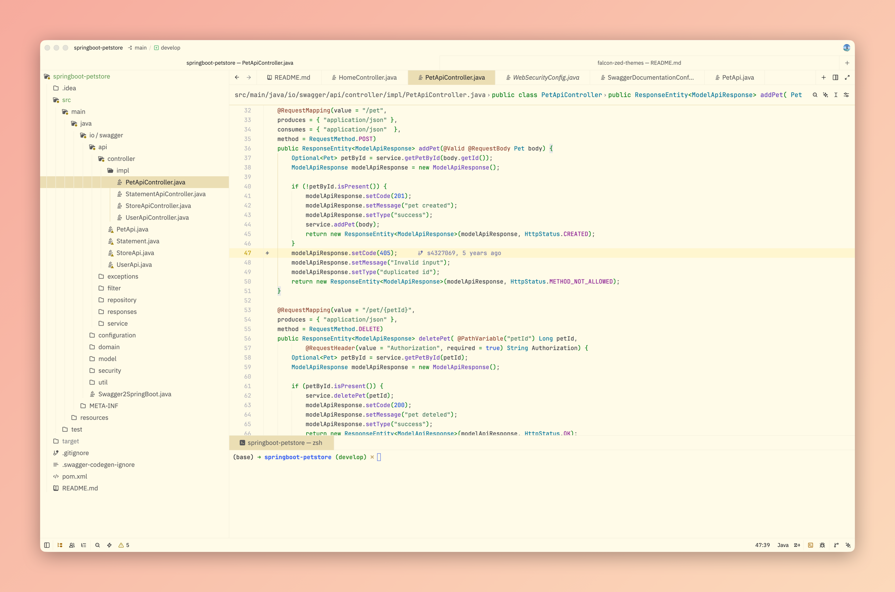
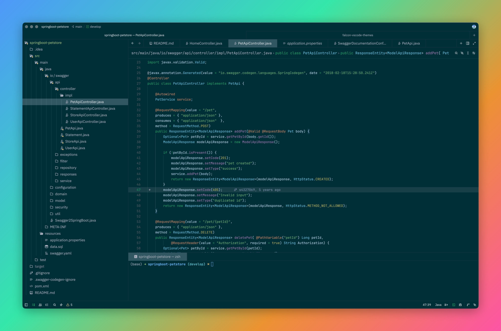

# Falcon Relaxing-Eyes Themes for [Zed](https://zed.dev)

> A gentle, eye-friendly theme to protect your eyesight for [Zed](https://zed.dev).
> 一个温和的，对眼睛友好，保护视力的 Zed 护眼主题

If you're working in a bright environment for extended periods, a light-colored theme is usually better.
 
You might want to try The Falcon Relaxing-Eyes Themes. 

在明亮的工作环境中，长时间使用 IDE，建议使用浅色主题，减少视觉疲劳。 

> <a href="https://ux.stackexchange.com/questions/53264/dark-or-white-color-theme-is-better-for-the-eyes">Dark or white color theme is better for the eyes?</a>

**Features:**

- 🌿 Gentle, eye-friendly colors to reduce strain
- ✨ Improved syntax highlighting for clarity
- 🎨 Consistent and clean theme style
- ⚡ Lightweight design with minimal impact on Zed - performance

## Included Themes

**Light themes (for bright environments):**

- [ ] Falcon Light Celadon (My favorite 💚)
- [x] Falcon Light Green
- [ ] Falcon Light Bean Green
- [ ] Falcon Light Grey
- [x] Falcon Light Pink
- [x] Falcon Light Yellow
- [ ] Falcon Light Buff

**Dark themes (for low-light environments):**

- [ ] Falcon Dark
- [ ] Falcon Dark Darcula
- [ ] Falcon Dark Blue
- [x] Falcon Dark Green
- [ ] Falcon Dark Violet
- [ ] Falcon Dark Coffee

## Install

See [Install Docs](./INSTALL.md) for detailed instructions.

## Source Code

- [Gitee](https://gitee.com/panxiaoan/falcon-zed-themes)
- [Github](https://github.com/panxiaoan/falcon-zed-themes)

## Issues

Found a bug or have a suggestion? <a href="https://github.com/panxiaoan/falcon-zed-themes/issues">Report an issue</a>

## License

See [MIT License](./LICENSE) for detailed instructions.

## Falcon Themes for VS Code, JetBrains

Using **VS Code?** You can also experience the same theme there.

👉 [Download from VS Code Marketplace](https://marketplace.visualstudio.com/items?itemName=panxiaoan.themes-falcon-vscode)

Using **JetBrains IDEs?** You can also experience the same theme there.

👉 [Download from Jetbrains Marketplace](https://plugins.jetbrains.com/plugin/26026-falcon-relax-eyes-light-theme)

## Light themes Screenshot

    
🌲 Green

    

    
🌸 Pink

    

    
🐣 Yellow

    

There is more coming soooooon!!!

## Dark themes Screenshot

    
🦚 Dark Green

    

There is more coming soooooon!!!
